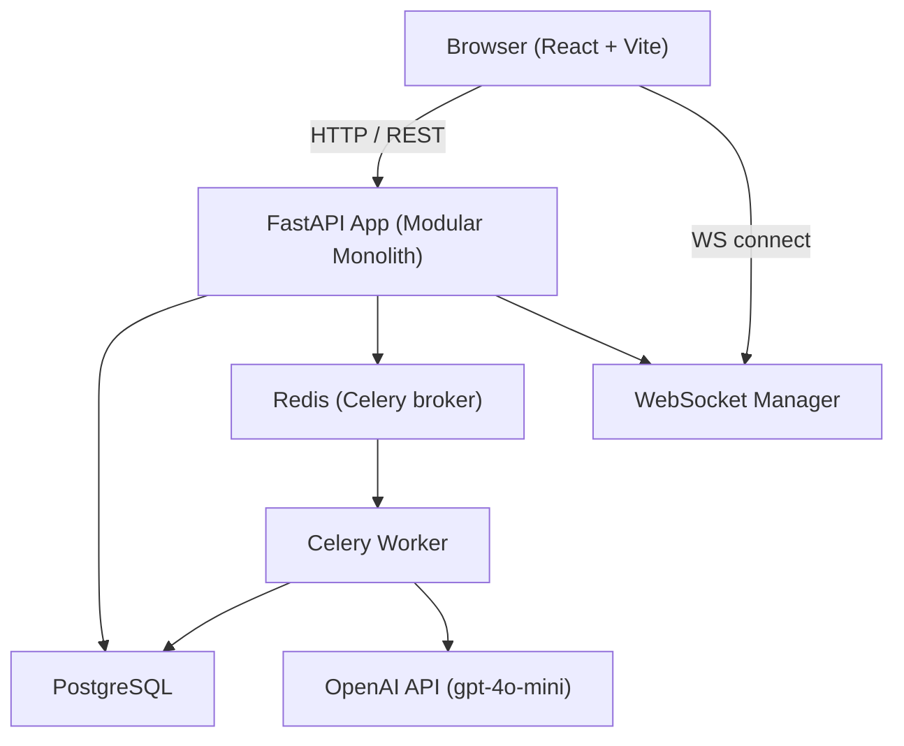
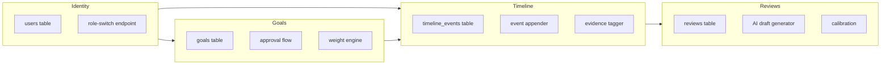
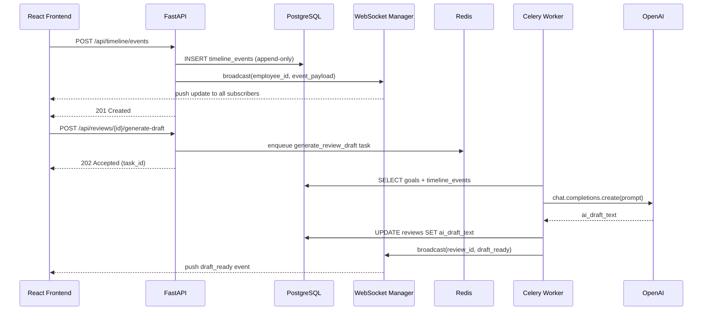
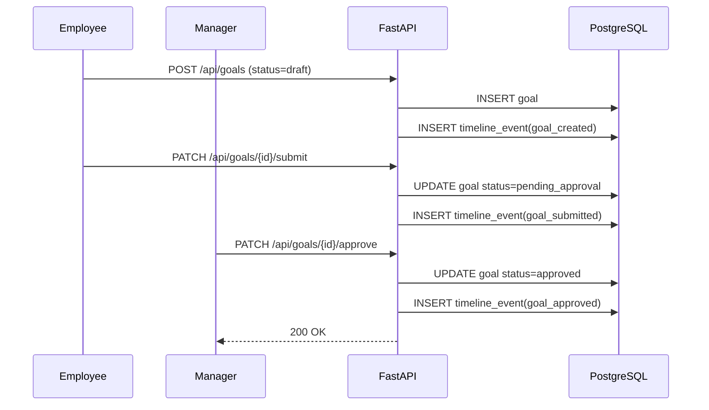

# Design Document: Event-Sourced Performance Ledger

## Overview

The Event-Sourced Performance Ledger is a hackathon-grade performance management system that replaces the typical CRUD approach with an append-only event log as the system of record. Every meaningful action — goal creation, progress update, feedback submission, check-in, peer review — is stored as an immutable `TimelineEvent`. The current state of any entity is derived by replaying its events, giving the system a full audit trail, a rich employee timeline UI, and a natural data source for AI-generated review drafts.

The system is structured as a **Modular Monolith** with four bounded contexts: `Identity`, `Goals`, `Timeline`, and `Reviews`. A React frontend communicates with a single FastAPI async backend. Real-time collaboration is handled via WebSockets. Background AI tasks (OpenAI review drafting) are offloaded to Celery workers. PostgreSQL stores both relational data and flexible JSONB event payloads.

The design targets a 52-hour hackathon execution window, so complexity is scoped: no real authentication (role switching via hardcoded dropdown), no multi-tenancy, no production-grade secrets management. Every architectural decision favors demo impact over operational rigor.

---

## Architecture

### System Context



### Bounded Contexts (Modular Monolith)




### Request Lifecycle



### Goal Approval Flow



---

## Components and Interfaces

### Identity Context

**Purpose**: User resolution and role-switching. No real auth — three hardcoded personas.

**Interface**:
```python
class UserRole(str, Enum):
    employee = "employee"
    manager = "manager"
    hr = "hr"

class UserRead(BaseModel):
    id: UUID
    name: str
    role: UserRole
    manager_id: Optional[UUID]

class RoleSwitchRequest(BaseModel):
    user_id: UUID  # one of the three hardcoded IDs
```

**Endpoints**:
- `POST /api/auth/switch-role` — sets `X-Current-User` session cookie
- `GET /api/employees/{id}/profile` — returns `UserRead + goals + recent_events`

**Responsibilities**:
- Provide current user context to all other contexts via dependency injection
- Return aggregated employee profile in a single round-trip


### Goals Context

**Purpose**: Manages goal lifecycle — creation, approval, progress tracking, weighting, cascading, and evidence tagging.

**Interface**:
```python
class GoalStatus(str, Enum):
    draft = "draft"
    pending_approval = "pending_approval"
    approved = "approved"
    rejected = "rejected"

class GoalHealth(str, Enum):
    on_track = "on_track"
    at_risk = "at_risk"
    off_track = "off_track"

class GoalCreate(BaseModel):
    employee_id: UUID
    parent_goal_id: Optional[UUID] = None
    title: str
    success_metric: str
    weight: Decimal  # must sum to 1.0 across employee's goals

class GoalRead(BaseModel):
    id: UUID
    employee_id: UUID
    parent_goal_id: Optional[UUID]
    title: str
    success_metric: str
    weight: Decimal
    status: GoalStatus
    progress: int  # 0-100
    health: GoalHealth
    children: List["GoalRead"] = []  # recursive for cascade tree

class GoalProgressUpdate(BaseModel):
    progress: int  # 0-100
    health: GoalHealth
    note: Optional[str]
```

**Responsibilities**:
- Validate that a goal's `weight` does not cause total employee weight to exceed 1.0
- Emit a `timeline_event` on every state transition
- Compute `overall_performance_score` via the weighting engine
- Support parent→child goal linkage for React Flow tree rendering

### Timeline Context

**Purpose**: Append-only event log. The system of record. Never updates or deletes rows.

**Interface**:
```python
class EventType(str, Enum):
    goal_created = "goal_created"
    goal_submitted = "goal_submitted"
    goal_approved = "goal_approved"
    goal_rejected = "goal_rejected"
    progress_updated = "progress_updated"
    feedback = "feedback"
    achievement = "achievement"
    check_in = "check_in"
    peer_review = "peer_review"
    evidence_tagged = "evidence_tagged"

class TimelineEventCreate(BaseModel):
    employee_id: UUID
    actor_id: UUID
    event_type: EventType
    payload: dict  # stored as JSONB
    linked_goal_id: Optional[UUID] = None

class TimelineEventRead(BaseModel):
    id: UUID
    employee_id: UUID
    actor_id: UUID
    event_type: EventType
    payload: dict
    linked_goal_id: Optional[UUID]
    created_at: datetime
    is_evidence: bool = False
```

**Responsibilities**:
- Enforce append-only semantics (no UPDATE/DELETE on this table)
- Support evidence tagging (mark event as pinned evidence for a specific goal)
- Provide paginated, filterable read API for Timeline UI
- Broadcast new events to WebSocket subscribers


### Reviews Context

**Purpose**: Manages performance review lifecycle, AI draft generation, and calibration.

**Interface**:
```python
class ReviewStatus(str, Enum):
    draft = "draft"
    in_progress = "in_progress"
    submitted = "submitted"
    calibrated = "calibrated"

class ReviewRead(BaseModel):
    id: UUID
    employee_id: UUID
    manager_id: UUID
    cycle_name: str
    ai_draft_text: Optional[str]
    manager_comments: Optional[str]
    final_rating: Optional[int]  # 1-5
    status: ReviewStatus
    manager_override: Optional[str]
    calibration_notes: Optional[str]

class GenerateDraftRequest(BaseModel):
    review_id: UUID

class CalibrationUpdate(BaseModel):
    manager_override: Optional[str]
    calibration_notes: Optional[str]
    final_rating: int  # 1-5
```

**Responsibilities**:
- Trigger async Celery task for AI draft generation
- Store raw AI output in `ai_draft_text`; allow manager to edit `manager_comments` separately
- Support calibration override with audit trail via timeline event

---

## Data Models

### `users`

```python
class User(Base):
    __tablename__ = "users"

    id: UUID = Column(UUID(as_uuid=True), primary_key=True, default=uuid4)
    name: str = Column(String, nullable=False)
    role: UserRole = Column(Enum(UserRole), nullable=False)
    manager_id: Optional[UUID] = Column(UUID(as_uuid=True), ForeignKey("users.id"), nullable=True)

    # Relationships
    direct_reports: List["User"] = relationship("User", backref=backref("manager", remote_side=[id]))
    goals: List["Goal"] = relationship("Goal", back_populates="employee")
```

### `goals`

```python
class Goal(Base):
    __tablename__ = "goals"

    id: UUID = Column(UUID(as_uuid=True), primary_key=True, default=uuid4)
    employee_id: UUID = Column(UUID(as_uuid=True), ForeignKey("users.id"), nullable=False)
    parent_goal_id: Optional[UUID] = Column(UUID(as_uuid=True), ForeignKey("goals.id"), nullable=True)
    title: str = Column(String, nullable=False)
    success_metric: str = Column(String, nullable=False)
    weight: Decimal = Column(Numeric(4, 3), nullable=False)  # e.g. 0.300
    status: GoalStatus = Column(Enum(GoalStatus), default=GoalStatus.draft)
    progress: int = Column(Integer, default=0)  # 0-100
    health: GoalHealth = Column(Enum(GoalHealth), default=GoalHealth.on_track)

    # Relationships
    children: List["Goal"] = relationship("Goal", backref=backref("parent", remote_side=[id]))
    timeline_events: List["TimelineEvent"] = relationship("TimelineEvent", back_populates="linked_goal")
```


### `timeline_events` (append-only)

```python
class TimelineEvent(Base):
    __tablename__ = "timeline_events"

    id: UUID = Column(UUID(as_uuid=True), primary_key=True, default=uuid4)
    employee_id: UUID = Column(UUID(as_uuid=True), ForeignKey("users.id"), nullable=False)
    actor_id: UUID = Column(UUID(as_uuid=True), ForeignKey("users.id"), nullable=False)
    event_type: EventType = Column(Enum(EventType), nullable=False)
    payload: dict = Column(JSONB, nullable=False)
    linked_goal_id: Optional[UUID] = Column(UUID(as_uuid=True), ForeignKey("goals.id"), nullable=True)
    created_at: datetime = Column(DateTime(timezone=True), server_default=func.now())
    is_evidence: bool = Column(Boolean, default=False)

    # NOTE: No updated_at — this table is append-only.
    # Enforce via DB trigger or application-layer guard (see Key Algorithms section).
```

**JSONB payload schemas by event_type**:

```python
# goal_created / goal_approved / goal_rejected / goal_submitted
GoalEventPayload = {
    "goal_id": str,         # UUID
    "title": str,
    "status": str,
    "note": Optional[str]   # rejection/approval note
}

# progress_updated
ProgressEventPayload = {
    "goal_id": str,
    "previous_progress": int,
    "new_progress": int,
    "previous_health": str,
    "new_health": str,
    "note": Optional[str]
}

# feedback / peer_review
FeedbackEventPayload = {
    "text": str,
    "sentiment_score": float,   # -1.0 to 1.0, computed async
    "is_anonymous": bool,
    "from_user_id": Optional[str]  # None when anonymous
}

# achievement
AchievementEventPayload = {
    "title": str,
    "description": str,
    "linked_goal_id": Optional[str]
}

# check_in
CheckInEventPayload = {
    "meeting_date": str,    # ISO date
    "notes": str,
    "action_items": List[str]
}

# evidence_tagged
EvidenceEventPayload = {
    "source_event_id": str,
    "goal_id": str,
    "tagged_by": str
}
```

### `reviews`

```python
class Review(Base):
    __tablename__ = "reviews"

    id: UUID = Column(UUID(as_uuid=True), primary_key=True, default=uuid4)
    employee_id: UUID = Column(UUID(as_uuid=True), ForeignKey("users.id"), nullable=False)
    manager_id: UUID = Column(UUID(as_uuid=True), ForeignKey("users.id"), nullable=False)
    cycle_name: str = Column(String, nullable=False)
    ai_draft_text: Optional[str] = Column(Text, nullable=True)
    manager_comments: Optional[str] = Column(Text, nullable=True)
    final_rating: Optional[int] = Column(Integer, nullable=True)  # 1-5
    status: ReviewStatus = Column(Enum(ReviewStatus), default=ReviewStatus.draft)
    manager_override: Optional[str] = Column(Text, nullable=True)
    calibration_notes: Optional[str] = Column(Text, nullable=True)
    ai_task_id: Optional[str] = Column(String, nullable=True)  # Celery task ID
    created_at: datetime = Column(DateTime(timezone=True), server_default=func.now())
    updated_at: datetime = Column(DateTime(timezone=True), onupdate=func.now())
```

**Validation Rules**:
- `final_rating` must be in range [1, 5]
- `weight` across all goals for one employee must sum to ≤ 1.0
- `progress` must be in range [0, 100]
- `timeline_events` rows must never be UPDATE'd or DELETE'd


---

## Key Functions with Formal Specifications

### `append_event(db, payload) -> TimelineEvent`

```python
async def append_event(
    db: AsyncSession,
    employee_id: UUID,
    actor_id: UUID,
    event_type: EventType,
    payload: dict,
    linked_goal_id: Optional[UUID] = None,
) -> TimelineEvent:
    event = TimelineEvent(
        employee_id=employee_id,
        actor_id=actor_id,
        event_type=event_type,
        payload=payload,
        linked_goal_id=linked_goal_id,
    )
    db.add(event)
    await db.flush()  # get ID without committing
    return event
```

**Preconditions:**
- `employee_id` and `actor_id` are valid UUIDs referencing existing `users` rows
- `event_type` is a member of `EventType` enum
- `payload` is a non-empty dict conforming to the schema for `event_type`
- If `linked_goal_id` is provided, it references an existing `goals` row owned by `employee_id`

**Postconditions:**
- A new row is inserted into `timeline_events` with a server-generated `created_at`
- No existing rows are modified
- The returned `TimelineEvent` has a valid UUID `id`
- The caller's transaction is NOT yet committed (allows atomic multi-event writes)

**Loop Invariants:** N/A

---

### `compute_performance_score(goals) -> Decimal`

```python
def compute_performance_score(goals: List[Goal]) -> Decimal:
    """
    Weighted completion score across all approved goals.
    Returns value in range [0.0, 100.0].
    """
    approved = [g for g in goals if g.status == GoalStatus.approved]
    if not approved:
        return Decimal("0.0")

    total_weight = sum(g.weight for g in approved)
    if total_weight == Decimal("0"):
        return Decimal("0.0")

    weighted_sum = sum(
        Decimal(g.progress) * g.weight
        for g in approved
    )
    # Normalize to percentage of allocated weight
    return (weighted_sum / total_weight).quantize(Decimal("0.01"))
```

**Preconditions:**
- `goals` is a list (may be empty)
- Each `goal.weight` is a non-negative `Decimal`
- Each `goal.progress` is an integer in [0, 100]

**Postconditions:**
- Return value is a `Decimal` in range [0.00, 100.00]
- If no approved goals exist, returns `Decimal("0.0")`
- Result is normalized by total allocated weight (not assumed to sum to 1.0)
- Does not mutate any goal object

**Loop Invariants:**
- `weighted_sum` grows monotonically as each approved goal is processed
- All previously summed goals had `status == approved`

---

### `generate_review_draft(review_id) -> None` (Celery task)

```python
@celery_app.task(bind=True, max_retries=3)
def generate_review_draft(self, review_id: str) -> None:
    db = SessionLocal()
    try:
        review = db.query(Review).filter_by(id=review_id).first()
        if not review:
            raise ValueError(f"Review {review_id} not found")

        goals = db.query(Goal).filter_by(employee_id=review.employee_id).all()
        events = (
            db.query(TimelineEvent)
            .filter_by(employee_id=review.employee_id)
            .order_by(TimelineEvent.created_at.asc())
            .all()
        )

        prompt = build_review_prompt(goals, events)
        response = openai_client.chat.completions.create(
            model="gpt-4o-mini",
            messages=[{"role": "user", "content": prompt}],
            temperature=0.7,
        )
        ai_text = response.choices[0].message.content

        review.ai_draft_text = ai_text
        review.status = ReviewStatus.in_progress
        db.commit()

        broadcast_draft_ready(review_id, ai_text)
    except Exception as exc:
        db.rollback()
        raise self.retry(exc=exc, countdown=30)
    finally:
        db.close()
```

**Preconditions:**
- `review_id` is a valid UUID string referencing an existing `reviews` row
- OpenAI API key is configured in environment
- Celery worker has DB access

**Postconditions:**
- `review.ai_draft_text` is set to non-empty string from OpenAI
- `review.status` transitions to `in_progress`
- A WebSocket broadcast is sent to `review_id` channel
- On failure after 3 retries, task moves to dead-letter queue; `review` is unchanged

**Loop Invariants:** N/A (no loops in task body)


---

## Algorithmic Pseudocode

### Main Event-Append Workflow

```pascal
ALGORITHM handle_timeline_event_post(request, current_user, db)
INPUT: request of type TimelineEventCreate, current_user of type User, db of type AsyncSession
OUTPUT: TimelineEventRead

BEGIN
  ASSERT current_user IS NOT NULL
  ASSERT request.employee_id IS VALID UUID IN users
  ASSERT request.event_type IN EventType

  // Step 1: Validate linked_goal_id if provided
  IF request.linked_goal_id IS NOT NULL THEN
    goal ← db.query(Goal).filter(id = request.linked_goal_id)
    IF goal IS NULL THEN
      RAISE HTTPException(404, "Goal not found")
    END IF
    IF goal.employee_id ≠ request.employee_id THEN
      RAISE HTTPException(403, "Goal does not belong to employee")
    END IF
  END IF

  // Step 2: Append event (no UPDATE path exists)
  event ← append_event(
    db,
    employee_id = request.employee_id,
    actor_id    = current_user.id,
    event_type  = request.event_type,
    payload     = request.payload,
    linked_goal_id = request.linked_goal_id
  )

  // Step 3: Commit atomically
  AWAIT db.commit()
  AWAIT db.refresh(event)

  // Step 4: Real-time broadcast
  broadcast_message ← serialize(event)
  AWAIT websocket_manager.broadcast(request.employee_id, broadcast_message)

  ASSERT event.id IS NOT NULL
  ASSERT event.created_at IS NOT NULL

  RETURN TimelineEventRead.from_orm(event)
END
```

**Preconditions:**
- `current_user` has been resolved from session cookie
- `request` has passed Pydantic validation

**Postconditions:**
- Exactly one new row exists in `timeline_events`
- All WebSocket subscribers for `employee_id` receive the event payload
- No existing rows were modified

**Loop Invariants:** N/A

---

### Goal Approval Algorithm

```pascal
ALGORITHM handle_goal_approve(goal_id, approval_note, current_user, db)
INPUT: goal_id UUID, approval_note Optional[String], current_user User, db AsyncSession
OUTPUT: GoalRead

BEGIN
  goal ← AWAIT db.get(Goal, goal_id)

  IF goal IS NULL THEN
    RAISE HTTPException(404)
  END IF

  IF current_user.role ≠ "manager" THEN
    RAISE HTTPException(403, "Only managers can approve goals")
  END IF

  IF goal.status ≠ GoalStatus.pending_approval THEN
    RAISE HTTPException(400, "Goal must be in pending_approval state")
  END IF

  // State transition
  goal.status ← GoalStatus.approved

  // Append immutable audit event
  AWAIT append_event(
    db,
    employee_id    = goal.employee_id,
    actor_id       = current_user.id,
    event_type     = EventType.goal_approved,
    payload        = { "goal_id": goal.id, "title": goal.title, "note": approval_note },
    linked_goal_id = goal.id
  )

  AWAIT db.commit()
  AWAIT db.refresh(goal)

  ASSERT goal.status = GoalStatus.approved

  RETURN GoalRead.from_orm(goal)
END
```

---

### Goal Cascade Tree Builder

```pascal
ALGORITHM build_goal_tree(all_goals)
INPUT: all_goals List[Goal]
OUTPUT: List[GoalRead]  -- only root goals, children nested recursively

BEGIN
  // Index goals by id for O(1) parent lookup
  goal_map ← { goal.id: GoalRead.from_orm(goal) FOR goal IN all_goals }

  roots ← []

  FOR each goal_read IN goal_map.values() DO
    IF goal_read.parent_goal_id IS NULL THEN
      roots.append(goal_read)
    ELSE
      parent ← goal_map.get(goal_read.parent_goal_id)
      IF parent IS NOT NULL THEN
        parent.children.append(goal_read)
      END IF
      // Orphaned children (parent deleted) are silently dropped
    END IF
  END FOR

  ASSERT ALL roots HAVE parent_goal_id = NULL
  ASSERT ALL non-root goals ARE nested under their parent

  RETURN roots
END
```

**Preconditions:**
- `all_goals` contains only goals for a single employee
- No circular parent references exist (enforced by DB constraint)

**Postconditions:**
- Returns only root goals (those with `parent_goal_id IS NULL`)
- Each root's `children` list is recursively populated
- Total node count in tree equals `len(all_goals)` minus orphans

**Loop Invariants:**
- `goal_map` is fully populated before the second pass begins
- Each iteration processes exactly one goal


### WebSocket Real-Time Broadcast Manager

```pascal
ALGORITHM websocket_manager
STATE: connections = Dict[UUID, Set[WebSocket]]

PROCEDURE connect(employee_id, websocket)
  IF employee_id NOT IN connections THEN
    connections[employee_id] ← Set()
  END IF
  connections[employee_id].add(websocket)
  AWAIT websocket.accept()
END PROCEDURE

PROCEDURE disconnect(employee_id, websocket)
  connections[employee_id].discard(websocket)
  IF connections[employee_id] IS EMPTY THEN
    DELETE connections[employee_id]
  END IF
END PROCEDURE

PROCEDURE broadcast(employee_id, message)
  IF employee_id NOT IN connections THEN
    RETURN  // no subscribers, silently skip
  END IF

  dead ← []
  FOR each ws IN connections[employee_id] DO
    TRY
      AWAIT ws.send_json(message)
    CATCH WebSocketDisconnect
      dead.append(ws)
    END TRY
  END FOR

  FOR each ws IN dead DO
    CALL disconnect(employee_id, ws)
  END FOR
END PROCEDURE
```

---

### Sentiment Analysis Pipeline (Async)

```pascal
ALGORITHM compute_sentiment(event_id, text, db)
INPUT: event_id UUID, text String, db AsyncSession
OUTPUT: None (mutates payload in-place via JSONB update)

BEGIN
  // Called as background task after feedback event is committed
  score ← openai_sentiment_classify(text)
  // score is float in [-1.0, 1.0]

  AWAIT db.execute(
    UPDATE timeline_events
    SET payload = payload || jsonb_build_object('sentiment_score', score)
    WHERE id = event_id
  )
  // NOTE: This is the ONE exception to append-only — we patch JSONB payload
  // for sentiment enrichment after the fact. This is acceptable because
  // the semantic content of the event (the feedback text) is not changed.
  AWAIT db.commit()
END
```

---

## Example Usage

### Create and Submit a Goal (Python / FastAPI route)

```python
# POST /api/goals
@router.post("/goals", response_model=GoalRead, status_code=201)
async def create_goal(
    payload: GoalCreate,
    current_user: User = Depends(get_current_user),
    db: AsyncSession = Depends(get_db),
):
    # Validate total weight won't exceed 1.0
    existing_weight = await get_total_goal_weight(db, payload.employee_id)
    if existing_weight + payload.weight > Decimal("1.0"):
        raise HTTPException(400, "Total goal weight would exceed 1.0")

    goal = Goal(**payload.dict())
    db.add(goal)
    await db.flush()

    # Append immutable creation event
    await append_event(
        db,
        employee_id=payload.employee_id,
        actor_id=current_user.id,
        event_type=EventType.goal_created,
        payload={
            "goal_id": str(goal.id),
            "title": goal.title,
            "weight": str(goal.weight),
        },
        linked_goal_id=goal.id,
    )

    await db.commit()
    await db.refresh(goal)
    return GoalRead.from_orm(goal)
```

### Trigger AI Review Draft (Python / FastAPI route)

```python
# POST /api/reviews/{review_id}/generate-draft
@router.post("/reviews/{review_id}/generate-draft", status_code=202)
async def trigger_ai_draft(
    review_id: UUID,
    current_user: User = Depends(get_current_user),
    db: AsyncSession = Depends(get_db),
):
    review = await db.get(Review, review_id)
    if not review:
        raise HTTPException(404)

    # Kick off async Celery task
    task = generate_review_draft.delay(str(review_id))
    review.ai_task_id = task.id
    await db.commit()

    return {"task_id": task.id, "status": "queued"}
```

### React: Subscribe to WebSocket Updates

```typescript
// hooks/useEmployeeTimeline.ts
function useEmployeeTimeline(employeeId: string) {
  const queryClient = useQueryClient()

  useEffect(() => {
    const ws = new WebSocket(`ws://localhost:8000/ws/${employeeId}`)

    ws.onmessage = (event) => {
      const data = JSON.parse(event.data)
      // Optimistically prepend new event to cached list
      queryClient.setQueryData(
        ['timeline', employeeId],
        (old: TimelineEvent[] | undefined) => [data, ...(old ?? [])]
      )
    }

    return () => ws.close()
  }, [employeeId, queryClient])

  return useInfiniteQuery({
    queryKey: ['timeline', employeeId],
    queryFn: ({ pageParam = 0 }) =>
      fetchTimeline(employeeId, { offset: pageParam, limit: 20 }),
    getNextPageParam: (lastPage, pages) =>
      lastPage.length === 20 ? pages.length * 20 : undefined,
  })
}
```


### React Flow Goal Cascade Tree

```typescript
// components/GoalCascadeTree.tsx
function buildFlowNodes(goals: GoalRead[]): { nodes: Node[]; edges: Edge[] } {
  const nodes: Node[] = []
  const edges: Edge[] = []

  function traverse(goal: GoalRead, depth: number, xOffset: number) {
    nodes.push({
      id: goal.id,
      type: 'goalNode',
      position: { x: xOffset * 250, y: depth * 150 },
      data: { label: goal.title, progress: goal.progress, health: goal.health },
    })

    goal.children.forEach((child, i) => {
      edges.push({ id: `${goal.id}-${child.id}`, source: goal.id, target: child.id })
      traverse(child, depth + 1, xOffset + i)
    })
  }

  goals.forEach((root, i) => traverse(root, 0, i * 3))
  return { nodes, edges }
}
```

---

## Correctness Properties

These properties must hold at all times. Each maps to one or more unit/property tests.

```python
# Property 1: Timeline immutability
# For all timeline_events rows e, no UPDATE or DELETE statement
# targeting timeline_events may succeed.
assert_no_mutation_on_timeline_events()

# Property 2: Goal weight invariant
# For all employees u, sum of weight of u's goals <= 1.0
for employee in all_employees:
    approved_goals = [g for g in employee.goals]
    assert sum(g.weight for g in approved_goals) <= Decimal("1.0")

# Property 3: Performance score bounds
# For all employees u, compute_performance_score(u.goals) IN [0.0, 100.0]
for employee in all_employees:
    score = compute_performance_score(employee.goals)
    assert Decimal("0.0") <= score <= Decimal("100.0")

# Property 4: Goal state machine — valid transitions only
# approved goals may not revert to draft or pending_approval
VALID_TRANSITIONS = {
    GoalStatus.draft: {GoalStatus.pending_approval},
    GoalStatus.pending_approval: {GoalStatus.approved, GoalStatus.rejected},
    GoalStatus.approved: set(),   # terminal
    GoalStatus.rejected: {GoalStatus.draft},  # allow resubmit
}
for transition in all_observed_transitions:
    assert transition.to_status IN VALID_TRANSITIONS[transition.from_status]

# Property 5: Every goal state transition has a corresponding timeline event
for goal in all_goals:
    events = [e for e in timeline_events if e.linked_goal_id == goal.id]
    goal_event_types = {e.event_type for e in events}
    if goal.status == GoalStatus.approved:
        assert EventType.goal_approved IN goal_event_types
    if goal.status == GoalStatus.rejected:
        assert EventType.goal_rejected IN goal_event_types

# Property 6: AI draft only set after Celery task completion
# review.ai_draft_text IS NOT NULL iff a generate_review_draft task completed successfully
for review in all_reviews:
    if review.ai_draft_text is not None:
        assert review.ai_task_id is not None
        assert review.status IN {ReviewStatus.in_progress, ReviewStatus.submitted, ReviewStatus.calibrated}

# Property 7: Evidence tags always reference valid events
for event in [e for e in timeline_events if e.is_evidence]:
    assert event.linked_goal_id is not None
    assert event.linked_goal_id IN {g.id for g in all_goals}

# Property 8: Sentiment score bounds
for event in [e for e in timeline_events
              if e.event_type in {EventType.feedback, EventType.peer_review}]:
    if "sentiment_score" in event.payload:
        assert -1.0 <= event.payload["sentiment_score"] <= 1.0
```

---

## Error Handling

### Scenario 1: Goal weight overflow

**Condition**: New goal `weight` would push employee's total above 1.0  
**Response**: `HTTP 400 Bad Request` with message `"Total goal weight would exceed 1.0. Current allocated: {current}"`  
**Recovery**: Client prompts user to reduce weight or adjust existing goals

### Scenario 2: Invalid goal state transition

**Condition**: Request attempts to approve a goal not in `pending_approval` state  
**Response**: `HTTP 400 Bad Request` with message `"Goal must be in pending_approval state to approve"`  
**Recovery**: Client refreshes goal state from server and re-renders action buttons

### Scenario 3: AI draft generation failure (OpenAI timeout/error)

**Condition**: OpenAI API call fails after 3 Celery retries  
**Response**: Task moved to dead-letter queue; `review.status` remains unchanged; WebSocket broadcasts `{"type": "draft_failed", "review_id": "..."}`  
**Recovery**: Frontend shows "AI generation failed — retry?" button; user can re-trigger

### Scenario 4: WebSocket subscriber disconnect during broadcast

**Condition**: Client disconnects mid-broadcast  
**Response**: `WebSocketDisconnect` is caught silently; dead socket is removed from connection set  
**Recovery**: Client reconnects automatically via React `useEffect` cleanup/re-mount

### Scenario 5: Timeline event with invalid `linked_goal_id`

**Condition**: `linked_goal_id` references a goal belonging to a different employee  
**Response**: `HTTP 403 Forbidden`  
**Recovery**: Client should not allow cross-employee goal linking in UI

### Scenario 6: Celery worker DB connection lost mid-task

**Condition**: DB connection drops during `generate_review_draft`  
**Response**: `db.rollback()` in `finally` block; task retries with exponential backoff  
**Recovery**: Review state is unchanged; next retry picks up fresh DB session

---

## Testing Strategy

### Unit Testing Approach

Key unit test targets:
- `compute_performance_score`: test with empty list, single goal at 0/50/100 progress, multiple goals with varying weights, total weight < 1.0
- `build_goal_tree`: flat list, two-level hierarchy, orphaned child (parent_goal_id points to nonexistent), circular reference guard
- `build_review_prompt`: verify all three sections appear in output string
- Goal state machine transitions: all valid transitions pass, all invalid transitions raise

### Property-Based Testing Approach

**Property Test Library**: `hypothesis` (Python)

```python
from hypothesis import given, strategies as st
from decimal import Decimal

@given(
    goals=st.lists(
        st.fixed_dictionaries({
            "progress": st.integers(min_value=0, max_value=100),
            "weight": st.decimals(min_value=Decimal("0.01"), max_value=Decimal("1.00"),
                                  places=3, allow_nan=False, allow_infinity=False),
            "status": st.just("approved"),
        }),
        min_size=0,
        max_size=10,
    )
)
def test_performance_score_always_in_bounds(goals):
    # Build Goal-like objects
    goal_objs = [SimpleNamespace(**g) for g in goals]
    score = compute_performance_score(goal_objs)
    assert Decimal("0.0") <= score <= Decimal("100.0")

@given(
    weights=st.lists(
        st.decimals(min_value=Decimal("0.01"), max_value=Decimal("0.30"), places=3),
        min_size=1, max_size=5,
    )
)
def test_weight_sum_never_exceeds_one(weights):
    # Simulate sequential goal creation with weight validation
    total = Decimal("0.0")
    for w in weights:
        if total + w > Decimal("1.0"):
            break
        total += w
    assert total <= Decimal("1.0")
```

### Integration Testing Approach

- Full round-trip: `POST /api/goals` → verify `timeline_events` row created → verify WebSocket broadcast received
- Celery task: enqueue `generate_review_draft` in eager mode (`CELERY_TASK_ALWAYS_EAGER=True`) → verify `review.ai_draft_text` is populated
- Append-only guard: attempt `UPDATE timeline_events` via SQLAlchemy → verify DB trigger raises error


---

## Performance Considerations

- **Timeline pagination**: Use `OFFSET/LIMIT` with `created_at DESC` index for the timeline scroll. Add `CREATE INDEX idx_timeline_employee_created ON timeline_events(employee_id, created_at DESC)`.
- **Aggregated profile endpoint**: `GET /api/employees/{id}/profile` should JOIN `users`, fetch latest 20 `timeline_events`, and return goals in a single DB round-trip using SQLAlchemy `selectinload`.
- **Goal tree**: All goals for an employee are fetched in one query; the tree is assembled in Python (not recursive CTE) for simplicity at hackathon scale.
- **WebSocket fan-out**: At hackathon scale (3 hardcoded users), in-memory `dict[UUID, Set[WebSocket]]` is sufficient. Production would use Redis pub/sub.
- **Celery task queue**: Redis as broker is sufficient for demo. Tasks are idempotent — re-running `generate_review_draft` with the same `review_id` overwrites `ai_draft_text`.
- **JSONB indexing**: Add `CREATE INDEX idx_timeline_event_type ON timeline_events(event_type)` to support filtered timeline queries (e.g., show only `feedback` events).

---

## Security Considerations

- **No real auth**: Role switching is implemented as a session cookie storing the selected `user_id`. This is intentional for hackathon demo purposes. A production system would use JWT + OAuth2.
- **JSONB injection**: All JSONB payloads are Pydantic-validated before insertion. Never use raw user strings as JSONB keys.
- **OpenAI prompt injection**: Employee-supplied text (goal titles, feedback) is placed in the prompt as data, not instructions. Wrap all user content in delimiters and instruct the model to treat them as data only.
- **Append-only enforcement**: Add a PostgreSQL trigger to `RAISE EXCEPTION` on any `UPDATE` or `DELETE` against `timeline_events`:

```sql
CREATE OR REPLACE FUNCTION prevent_timeline_mutation()
RETURNS TRIGGER AS $$
BEGIN
  RAISE EXCEPTION 'timeline_events is append-only';
END;
$$ LANGUAGE plpgsql;

CREATE TRIGGER enforce_append_only
BEFORE UPDATE OR DELETE ON timeline_events
FOR EACH ROW EXECUTE FUNCTION prevent_timeline_mutation();
```

- **CORS**: FastAPI CORS middleware configured to allow only `http://localhost:5173` (Vite dev server) in development.

---

## Dependencies

### Backend

| Package | Version | Purpose |
|---|---|---|
| `fastapi` | `^0.111` | Async web framework |
| `uvicorn` | `^0.30` | ASGI server |
| `sqlalchemy` | `^2.0` | Async ORM |
| `asyncpg` | `^0.29` | Async PostgreSQL driver |
| `alembic` | `^1.13` | DB migrations |
| `pydantic` | `^2.7` | Data validation |
| `celery` | `^5.4` | Background task queue |
| `redis` | `^5.0` | Celery broker + result backend |
| `openai` | `^1.30` | OpenAI API client |
| `websockets` | `^12.0` | WebSocket support |
| `httpx` | `^0.27` | Async HTTP client (for tests) |
| `pytest-asyncio` | `^0.23` | Async test runner |
| `hypothesis` | `^6.100` | Property-based tests |

### Frontend

| Package | Version | Purpose |
|---|---|---|
| `react` | `^18` | UI framework |
| `vite` | `^5` | Build tool / dev server |
| `tailwindcss` | `^3` | Utility CSS |
| `@tanstack/react-query` | `^5` | Server state / caching |
| `zustand` | `^4` | Client state (current user) |
| `reactflow` | `^11` | Goal cascade tree visualization |
| `@radix-ui/react-slider` | `^1` | Rating slider (1-5) |
| `date-fns` | `^3` | Date formatting in timeline |

### Infrastructure

| Service | Purpose |
|---|---|
| PostgreSQL 16 | Primary datastore |
| Redis 7 | Celery broker + WebSocket pub/sub (future) |
| Docker Compose | Local orchestration |

---

## Project Structure

```
event-sourced-performance-ledger/
├── backend/
│   ├── app/
│   │   ├── main.py                  # FastAPI app factory, CORS, WebSocket endpoint
│   │   ├── database.py              # Async SQLAlchemy engine + session
│   │   ├── models/
│   │   │   ├── user.py
│   │   │   ├── goal.py
│   │   │   ├── timeline_event.py
│   │   │   └── review.py
│   │   ├── schemas/                 # Pydantic request/response models
│   │   ├── routers/
│   │   │   ├── auth.py              # /api/auth/switch-role
│   │   │   ├── employees.py         # /api/employees/{id}/profile
│   │   │   ├── goals.py             # /api/goals + /api/goals/{id}/approve
│   │   │   ├── timeline.py          # /api/timeline/events
│   │   │   └── reviews.py           # /api/reviews/{id}/generate-draft
│   │   ├── services/
│   │   │   ├── goal_service.py      # compute_performance_score, build_goal_tree
│   │   │   ├── timeline_service.py  # append_event
│   │   │   └── websocket_manager.py
│   │   └── tasks/
│   │       ├── celery_app.py
│   │       └── review_tasks.py      # generate_review_draft Celery task
│   ├── alembic/
│   │   └── versions/
│   ├── seed.py                      # Demo data seeder (Riya, Alex, HR Admin)
│   └── requirements.txt
├── frontend/
│   ├── src/
│   │   ├── components/
│   │   │   ├── Timeline/
│   │   │   ├── GoalCascadeTree/
│   │   │   └── ReviewSplitView/
│   │   ├── hooks/
│   │   │   ├── useEmployeeTimeline.ts
│   │   │   ├── useGoals.ts
│   │   │   └── useReview.ts
│   │   ├── store/
│   │   │   └── userStore.ts         # Zustand: current user + role
│   │   └── api/
│   │       └── client.ts            # Axios / fetch wrappers
│   └── vite.config.ts
└── docker-compose.yml
```
